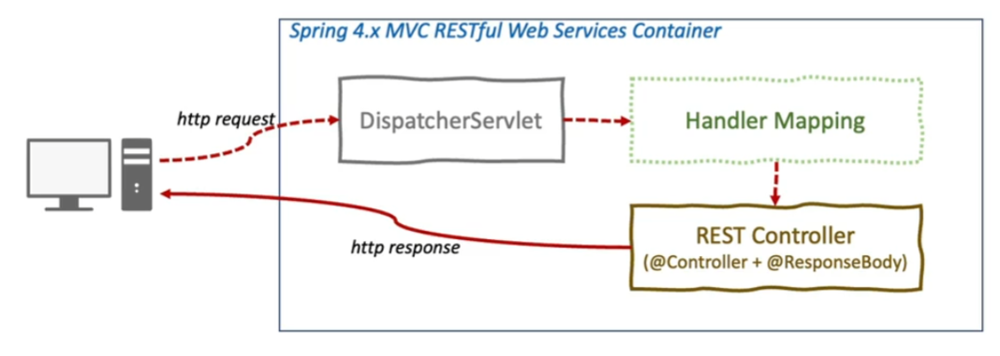

# springboot 프로젝트 기록
## 프로젝트 동작

### DispatcherSwervlet
* 클라이언트의 모든 요청을 한곳으로 받아서 처리
* 요청에 맞는 handler로 요청 전달
* handler의 실행 결과를 http response 형태로 반환

### RestController
* @RestController 로 사용
* @Controller + @ResponseBody
* View를 갖지 않는 Rest Data (JSON)를 반환