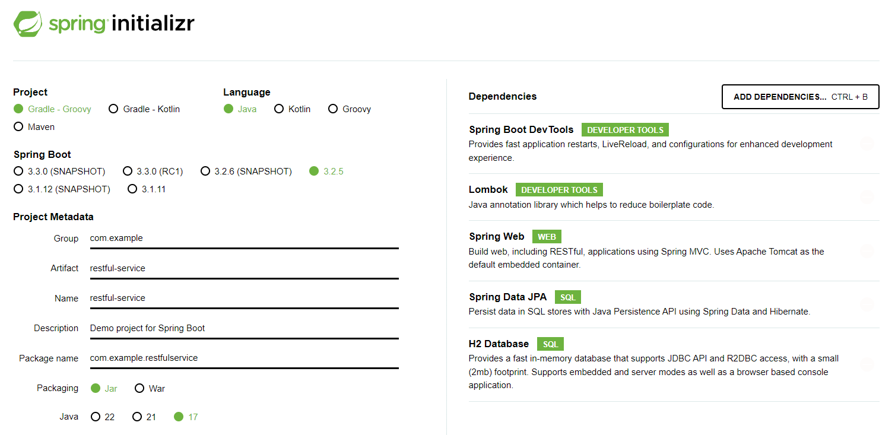

# springboot 프로젝트 기록
## 환경설정
### Java 버전 업데이트
* springboot 3.x.x 버전부터 java 17 버전을 사용해야함
* cmd에서 자바 버전 확인 후 업데이트
```
java -version
```
* java 설치 및 환경변수 등록
  * https://ziszini.tistory.com/103

### spring initializr

* 프로젝트 생성을 위한 압축파일 생성
  * https://start.spring.io/

## springboot 프로젝트 실행
### sprigboot 버전 오류
* 3.x.x 버전 변경으로 인한 오류 발생시
  * https://jojoldu.tistory.com/698

