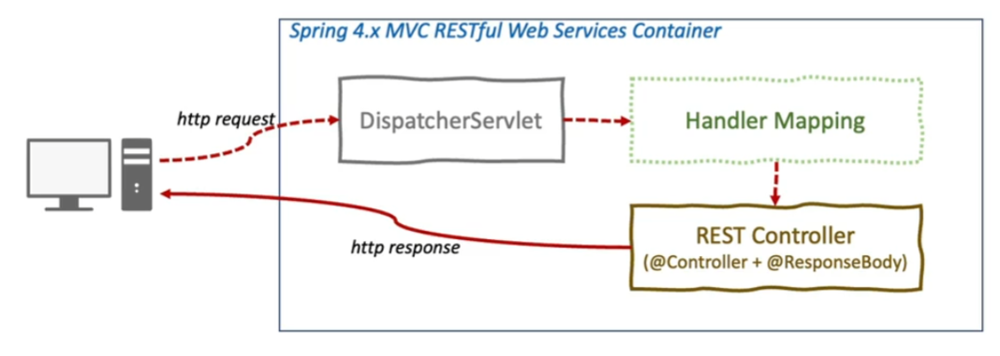

# springboot 프로젝트 기록
## 프로젝트 동작

### DispatcherSwervlet
* 클라이언트의 모든 요청을 한곳으로 받아서 처리
* 요청에 맞는 handler로 요청 전달
* handler의 실행 결과를 http response 형태로 반환

### RestController
* @RestController 로 사용
* @Controller + @ResponseBody
* View를 갖지 않는 Rest Data (JSON)를 반환

### Lombok
* @Data : 롬복을 사용하여 getter, setter 생성
* @AllArgsConstructor : 모든 필드를 인자로 받는 생성자 자동으로 생성 
  * -> 모든 필드 초기화
* @NoArgsConstructor : 기본 생성자(아무 인자도 받지 않는 생성자)를 자동으로 생성, 디폴트 생성자
  * -> 초기값을 설정할 필요가 없거나, 나중에 할 때