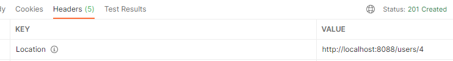
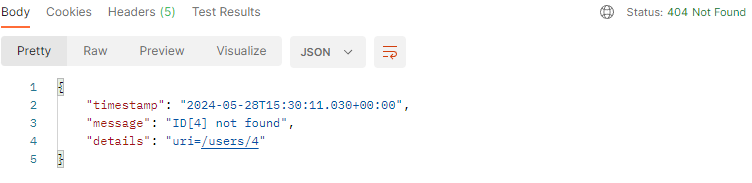

# springboot 프로젝트 기록
## user service
### User
* 사용자 도메인
  * 사용자 관리에 필요한 사용자 정보
* 사용자 서비스
  * 사용자서비스에 관련된 비즈니스 로직
  * JPA를 활용하여 DB에 저장

### UserDaoService
* @Component 를 사용하여 등록
  * @Service 를 사용해도 무방하지만,
  * bean의 역할도 같이 하기 위해서 사용

### UserController
* @RestController 를 사용하여 controller로 사용
* IntelliJ 에서 마우스 오른쪽 버튼 -> generate -> 생성자, setter, getter 생성 가능
* @PathVariable 를 사용하여 URI에서 변수 받아와 사용
* @RequestBody 를 사용하여 JSON과 같은 형태로 데이터 받아서 사용

### HTTP Status Code
* ResponseEntity 를 사용하여 클라이언트에 데이터 반환
* 상황에 맞는 status code 반환
* ServletUriComponentsBuild 사용하여 
  * .path() : 기존 URI 주소에 path 안의 정보 추가한 URI
  * .buildAndExpand() : 어떤 정보를 받아서 URI에 사용하거나 전달
  * .toUri() : URI 정보로 만들어 전달

### Exception Handling 예외 처리
* exception 패키지에 예외 처리 클래스들 생성하여 관리
* @ResponseStatus 를 사용하여 HTTP Status Code 설정
* 4xx : 클라측 에러
* 5xx : 서버측 에러

#### AOP Aspect Oriented Programming
* AOP
  * 관점(Aspect)을 기준으로 모듈화
  * 핵심 관점 : 핵심 비즈니스 로직
  * 부가 관점 : 앱에서 공통적으로 처리되어야 하는 로직 (데이터베이스 작업, 로깅, 예외처리 등)
* 예외처리시 
* ResponseEntityExceptionHandler 상속받아 내가 원하는 exception handler 클래스 생성
* @ControllerAdvice 사용하여 모든 controller에서 발생하는 예외처리 등록
* @ExceptionHandler(Exception.class) 를 통해서 Exception 클래스를 인자로 받는 모든 예외를 처리
* AOP 로 작동하여 예외처리 발생시 특정 예외처리 메소드가 무조건 실행되도록 설계 가능

