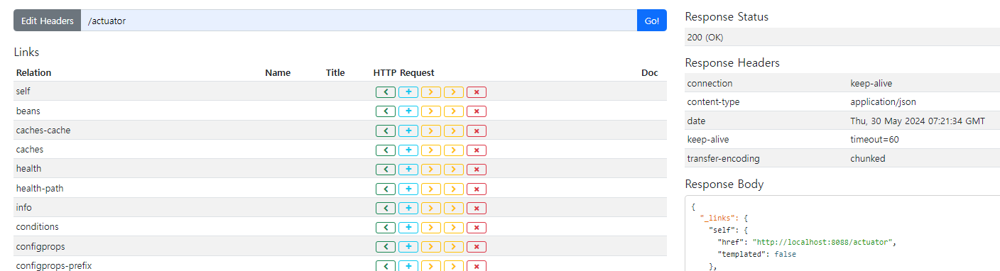

# springboot 프로젝트 기록
## springboot API
### HATEOAS
* Hypermedia As the Engine Of Application State
* 현재 리소스와 연관된 호출 가능한 자원 상태 정보 제공

### Swagger
* http://localhost:8088/swagger-ui/index.html

#### config
* SwaggerConfiguration 등록
* @OpenAPIDefinition : Swagger 문서에 대한 정보 작성
* @Bean 등록한 GroupedOpenApi 를 통해 특정 URI에 대해서만 매칭 가능

#### domain
* @Schema : 도메인 객체와 필드에 대한 상세 설명 입력

#### controller
* @Tag : 컨트롤러에 대한 상세 설명 입력
* @Operation : 해당 클래서의 메소드에 대한 상세 설명 입력
* @ApiResponses : 응답코드와 설명 입력
* @Parameter : pathvariable과 같은 파라미터에 대한 설명 입력

### actuator
* http://localhost:8088/actuator
* 어플리케이션의 상태를 모니터링하고 관리하기 위한 기능 제공
* application.yml 을 통해서 필요한 actuator 기능 오픈
  * "*"을 사용하면 모든 기능
```yml
management:
  endpoints:
    web:
      exposure:
        include: "*"
```

### HAL Explorer
* API 정보 제공
* API 쉽게 검색 및 테스트 가능
* http://localhost:8088/


### Spring Security
* Spring 기반의 어플리케이션의 보안, 인증, 권한 등을 처리하는 프레임워크
* application.yml 에서 authorization에 사용할 name, password 직접 설정 가능
```yml
spring:
  security:
    user:
      name: 
      password: 
```
* 혹은 SecurityConfiguration 등록하여 name, password 설정 가능
```java
        UserDetails newUser = User
                .withUsername("id")
                .password(passwordEncoder().encode("pw"))
                .authorities("read")
                .build();
```
* BCryptPasswordEncoder 를 사용하여 비밀번호 암호화 가능
```java
    @Bean
    BCryptPasswordEncoder passwordEncoder() {
        return new BCryptPasswordEncoder();
    }
```
