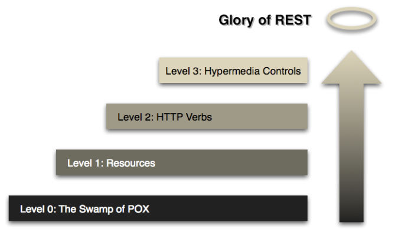

# springboot 프로젝트 기록
## Restful API 설계
### Richardson Maturity Model
#### Level 0
* URI 매핑만 가지고 있는 단계

#### Level 1
* 적절한 URI로 리소스 노출

#### Level 2
* Level 1 에서 HTTP Methods 사용
* 적절한 HTTP Method 사용

#### Level 3
* Level 2 에서 HATEOAS 사용
* 서버에서 다음으로 행동할 수 있는 것들 정보 제공

### 설계시 고려사항
* API를 사용하는 소비자 입장에서 설계
* HTTP의 장점 잘 활용하기 (HTTP Method, request, response 등)
* 적절한 HTTP Methods 및 Status Code 사용
* 중요한 정보는 URI에 담지 않기
* 복수형태로 URI 사용
  * 특정 요소를 표현할 때는 /를 통해 depth로 표현
* 동사의 사용 지양하고 명사로 표현 지향
* 일관된 URI endpoint 사용
  * 하나의 URI 에서 parameter, header, HTTP Method 등으로 다양하게 사용 가능